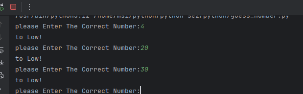
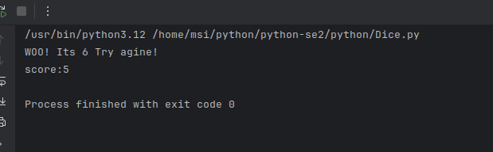
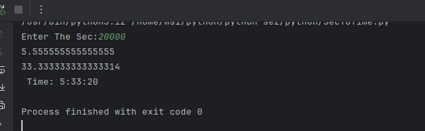
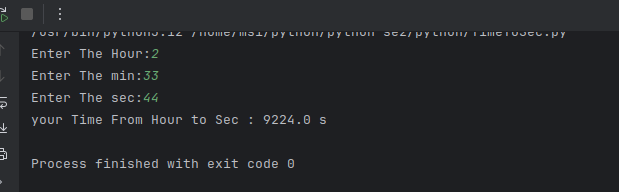
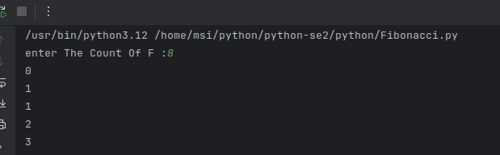

<h1> introduction-python </h1>

<h3> its a python cours and this practies are therefor</h3>

<h5>List of Pyhon Project </h5>

<ol>
  <h4>SE.1</h4>
  <li>calcluator</li>
  <li>BMI</li>
  <li>Degree</li>
  <li>Triangle</li>  
 <h4>SE.2</h4>
  <li>guess-number</li>
  <li>Dice</li>
  <li>secToHour</li>
  <li>timetoSec</li>
  <li>updateDgree</li>
  <li>fionachi</li>
  <h4>SE.3</h4>
   <li>hang-man game</li>
  <li>random-list</li>
  <li>is this list sorted?</li>
  <li>G.D.C</li>
  <li>L.C.M</li>
   <li>my-sanke</li>
   <li>word-counter</li>
</ol>

<h5>List of PHP Project</h5>
<h4>SE.1</h4>
<ol>
  <li>calcluator</li>
  <li>BMI</li>
  <li>Degree</li>
  <li>Triangle</li>  
   <h4>SE.2</h4>
  <li>guess-number</li>
  <li>Dice</li>
  <li>secToHour</li>
  <li>timetoSec</li>
  <li>updateDgree</li>
  <li>fionachi</li>
  <h4>SE.3</h4>
  <li>random-list</li>
  <li>is this list sorted?</li>
  <li>G.D.C</li>
  <li>L.C.M</li>
   <li>my-sanke</li>
   <li>word-counter</li>
</ol>

 

<h2> calcluator </h2>

<h3>1 . its a calculator that you can used unlimited time </h3>

<h5>Features 💫</h5>
<a>
  <li>plus/min/multi/div Opration</li>
  <li>Sin/Cos/tan/fact Operation</li>
  <li>unlimited Oprations</li>
</a>

<h5>Tech`s 🔧 </h5>

 

 
<h2> BMI </h2>

<h3>2 . This program can measure your BMI and show you its value and tell you if your health is at risk or not.  </h3>

<h5>Features 💫</h5>
<ol>
  <li>satus obesside</li>
</ol>
 

<h5>Tech`s 🔧 </h5>

 

 
<h2> Degree`s </h2>

<h3>3 . This part can calculate your GPA </h3>

<h5>Features 💫</h5>
<ol>
  <li> satus obesside</li>
</ol>

<h5>Tech`s 🔧 </h5>

 

 
<h2> Triangle </h2>

<h3>4 . According to the entered sides, it can confirm the correctness of the triangle (according to the law that one of the sides of the triangle should not be greater than the sum of the other two</h3>

<h5>Features 💫</h5>
<ol>
  <li>compare between sides of a Triangle </li>
  <li>It is possible or impossible to form a triangle</li>
</ol>

<h5>Tech`s 🔧 </h5>

 

 

<h2> guess-number-game </h2>

<h3>5 . comuter will make a number randomly and user have to guess what it is</h3>

<h5>Features 💫</h5>
<ol>
  <li>guiding user to reach to correct number</li>
  <li>showing that how many times that user tried</li>
</ol>

<h5>Tech`s 🔧 </h5>

 

 

<h2> Dice </h2>

<h3>6 . random dice , when it come to 6 user have a bounes!</h3>

<h5>Features 💫</h5>
<ol>
  <li>automaticlly works</li>

</ol>

<h5>Tech`s 🔧 </h5>

 

 
<h2> sec To Hours </h2>

<h3>4 . it will give  sec from you and turn into hours , min , remain sec</h3>

<h5>Features 💫</h5>
<ol>
  <li>showing exactly H:M:S </li>
</ol>

<h5>Tech`s 🔧 </h5>

 

 

<h2> Hours to sec </h2>

<h3>4 . it will give hours abnd min ,  turn it into sec </h3>

<h5>Features 💫</h5>
<ol>
  <li>counting sec and min`s to hours in process</li>

</ol>

<h5>Tech`s 🔧 </h5>

 

 

<h2> fibonachy algorithem </h2>

<h3>4 . just give it how many step you want to see this process and it will continue it until reach ti it </h3>

<h5>Features 💫</h5>
<ol>
  <li>makeing fibonachy process correctly</li>

</ol>

<h5>Tech`s 🔧 </h5>

 

 

<h2>se.3</h2>

<h2> hang-man game</h2>

<h3>select the word automatically and turn its charcters to array and check the users response for the correct or false answer  </h3>

<h5>Features 💫</h5>
<ol>
  <li>gang-man game structer </li>
<li>finding the correct or wrong </li>
  <li>counting user mistakes</li>
</ol>

<h5>Tech`s 🔧 </h5>

 

 
<h2> random-list</h2>

<h3>this will give you a number & create a list that its index will be equall to youe number 
these index`s are random numbers </h3>

<h5>Features 💫</h5>
<ol>
  <li> generating array with random numbers </li>

</ol>

<h5>Tech`s 🔧 </h5>

 

 

<h2>is this list sorted?</h2>

<h3>this code will check that do list that user entered is sorted or not? </h3>

<h5>Features 💫</h5>
<ol>
  <li> true or false of this test</li>
</ol>

<h5>Tech`s 🔧 </h5>

 

 

<h2>G.D.C</h2>

<h3>this code will ask you two parameter and return its G.D.C</h3>

<h5>Features 💫</h5>
<ol>
  <li> G.D.C of tow number </li>
</ol>

<h5>Tech`s 🔧 </h5>

 

 

<h2>L.C.M</h2>

<h3>this code will ask you two parameter and return its L.C.M</h3>

<h5>Features 💫</h5>
<ol>
  <li> L.C.M of tow number </li>
</ol>

<h5>Tech`s 🔧 </h5>

 

 

<h2>L.C.M</h2>

<h3>this code will ask you two parameter and return its L.C.M</h3>

<h5>Features 💫</h5>
<ol>
  <li> L.C.M of tow number </li>
</ol>

<h5>Tech`s 🔧 </h5>

 

 
<h2>my-sanke</h2>

<h3>will give a param from user and generating a snake using this -> (*#) <- characters </h3>

<h5>Features 💫</h5>
<ol>
  <li> generate snake using the user number </li>
</ol>

<h5>Tech`s 🔧 </h5>

 

 
<h2>word-counter</h2>

<h3>this code will give a sentece and count its words (no limitation...)</h3>

<h5>Features 💫</h5>
<ol>
  <li> counting words in a sentence </li>
</ol>

<h5>Tech`s 🔧 </h5>

 

 
