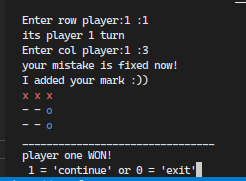
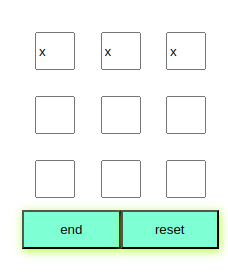
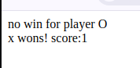
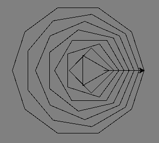

# SE.6

list of project:
- tic toc toe game
 1. python:

 2. PHP

- turtle ring(python only)

## Documentation

[turtle](https://docs.python.org/3/library/turtle.html)

[python](https://docs.python.org)

[PHP](https://www.php.net)
## Features

- ability to single / multi play
- counting scores for both 
- add score when a player win

## Lessons Learned

- using functions in projects
- how to use turtle(python)

## 🛠 Tech Stack

## 🔗 Links

