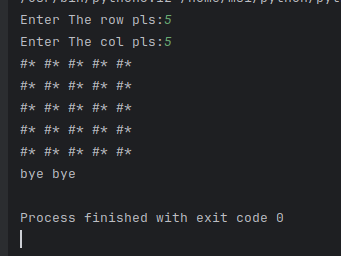
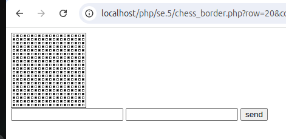
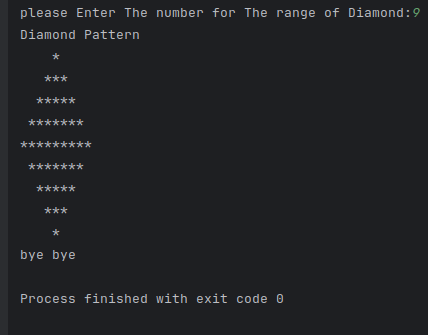
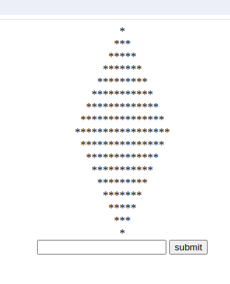
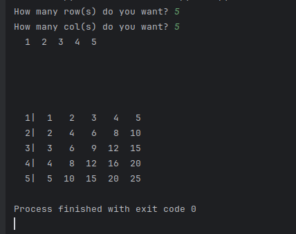
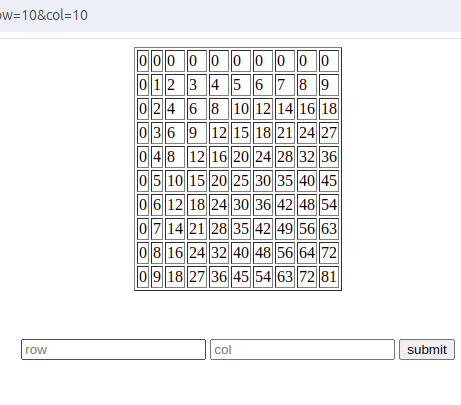
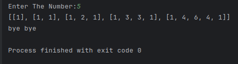
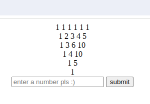

<h3>List of projects 🖹</h3>
* chess border maker
* diamond pattern
* multiply table 
* pascal triangle

<h3>features 💻</h3>

<h3>1. chess border maker</h3>

it will take  <b>2 parameters (n,m)</b> and generate a chess border using *#  

* python
 

* php
 

 

<h3>2. diamond pattern </h3>

it will take 1 param and make a diamond with star [*] mark

* python
 

* php
 

 

<h3>3. multiply table </h3>

it will take  <b>2 parameters (n,m)</b> and generate a multiply table with parameters  

* python
 

* php
 

 

<h3>4. pascal triangle</h3>

take 1 param and continue pascal triangle with that number

* python
 

* php
 

 

<h2>tech`s ⚙️</h2>

 

<h2>what do i learn in this session? 🌱</h2>

generally how to use function and a good start for OOP tech

<h2>how to use this project?  🔧</h2>

<ol>
<li>install python 3</li>
</ol>

<h4>Made with ❤️‍🔥 by <a href="https://www.moeinfadakar.ir" style="text-shadow: 1px 1px 10px red; color:black;font-size:30px; padding:5px" >moein fadakar</a> 2024 </h4>
